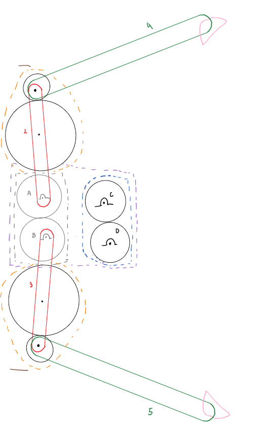
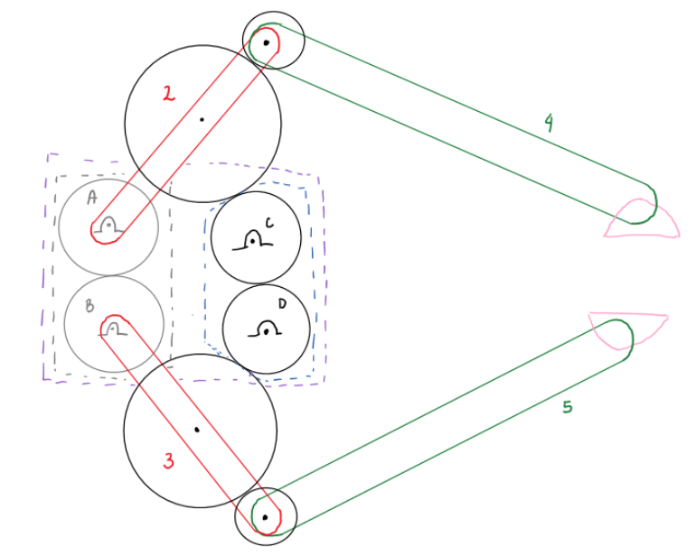
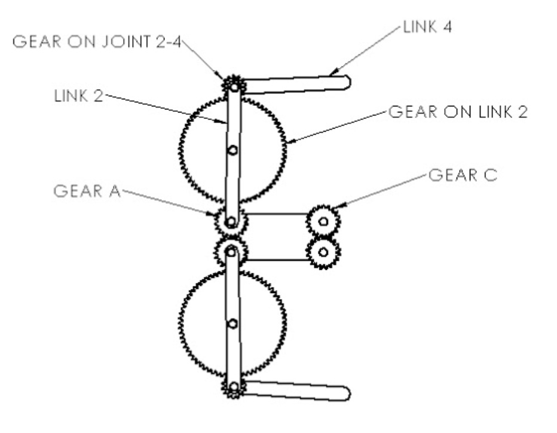
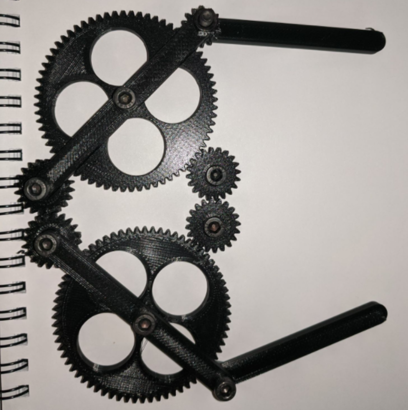

# Planar-Gripper-Design
> A planar claw gripper capable of holding the weight of a 200g, 50mm cup is designed to operate in two stages with 2 separater motors and gear trains. The design simulated via the analytical force method obtains the shaking moments, shaking forces and plotted displacements of the rotating links.  

## Table of contents
* [General info](#general-info)
* [Technologies](#technologies)
* [Simulated Results](#simulated-results)
* [Design Assembly](#design-assembly)
* [Final Prototype](#final-prototype)
* [Status](#status)
* [Contact](#contact)

## General info
The purpose of this project is to implement an a planar gripper that can carry a 200g and 50mm cup without experiencing buckling. 

## Technologies
* MATLAB R2020a

## Design Schematic
This design iteration is based on a 2 stage claw design that is reliant on two gear trains that cause independent motion between the linkage pairs 2,3 and 4,5. Links 2 and 3 are drawn in red and labelled accordingly. Links 4 and 5 are drawn in green. The first gear train drawn in grey indicates where the first motor will be located. The second gear train, drawn in black consists of multiple gears and indicates where the second motor will be located. The dotted purple line indicates the base link. The components drawn in pink are extensions of links 4 and 5 intended to maximize friction between the cup and gripper prongs. 

> Open Claw

At stage 1 the claw is fully retracted outward. The gears within the dotted orange border do not mesh with the gears that are fixed on the base link. While the claw is fully retracted, motor 1 will run to rotate the gears in the grey gear train. Due to the gear train, links 2 and 3 will rotate inwards until the gears attached to the center points of the links mesh with the second gear train.

> Closed Claw

At stage 2 the grey gear train rotates causing the links (2 and 3) to move inwards. The motion enables the gears attached to the red links to mesh with the fixed gears at the base. After the gears have meshed and the second gear train rotates (due to the second motor), links 4 and 5 rotate inwards. 

## Design Assembly

> CAD Drawings

## Final Prototype

> 3D Printed Design

## CAD Simulation
> [Google Drive Shareable Link](https://drive.google.com/file/d/1JV9sbhNlPb88Fd5_gYw9fAsfWXPp2F5t/view?usp=sharing)

## Status
Project is: _finished_

## Contact
> Created by [@akansha-n888](https://www.linkedin.com/in/akansha-nagar/),
> [Rohan Syal](mailto:rohan.syal@ryerson.ca?subject=[GitHub]%20Source%20Han%20Sans),
> [Celia Lin](mailto:celia.lin@ryerson.ca?subject=[GitHub]%20Source%20Han%20Sans),
> [Jacob Sunglao](mailto:jacob.sunglao@ryerson.ca?subject=[GitHub]%20Source%20Han%20Sans),
> [Hinesh Maisuria](mailto:hmaisuria@ryerson.ca?subject=[GitHub]%20Source%20Han%20Sans)
